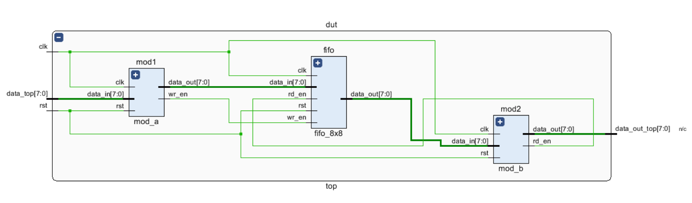
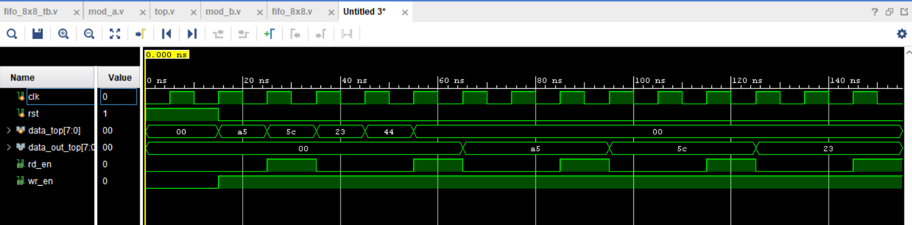

# Synchronous FIFO Buffer System with FSM Controller

A complete, synthesizable Verilog RTL design featuring an 8x8 Synchronous FIFO memory buffer integrated with an upstream data pipeline module (`mod_a`) and a downstream Finite State Machine (FSM) consumer module (`mod_b`). 

This project demonstrates proper clock-edge synchronization, multi-module structural interconnection, pointer wrap-around logic for status flag calculation, and glitch-free FSM design in Verilog.

---

##  Architecture & Elaborated Design

The system is designed as a three-stage pipelined stream processor. 
1. **`mod_a` (Data Generator):** Registers incoming data and automatically asserts the `wr_en` strobe.
2. **`fifo_8x8` (Queue Buffer):** A circular queue tracking 8 slots of 8-bit data using 4-bit pointers to easily identify `full` and `empty` states without counter-registers.
3. **`mod_b` (FSM Consumer):** A 3-state controller (`idle` -> `s1` -> `data_phase`) that safely asserts `rd_en` to pop data from the FIFO and present it at the system output.

### Block Diagram / Elaborated Design View
Below is the structural RTL connection map of the top-level module:



*(Note: Replace the image path above with your exported RTL Schematic from Vivado)*

---

##  Functional Simulation & Waveform Output

The design was verified using a custom testbench (`fifo_8x8_tb`) driving a 100MHz clock (`10ns` period). Data bytes (`8'hA5`, `8'h5C`, `8'h23`, `8'h44`) are streamed into `data_top` after a 2-cycle asynchronous reset recovery phase.

### Simulation Waveform Snapshot
The image below shows the automatic handshaking where `mod_b` transitions states, asserts `rd_en`, and captures data sequentially:



*(Note: Replace the image path above with your simulation waveform screenshot)*

---

##  Repository Structure

```text
├── rtl/
│   ├── top.v           # Main structural top-level module
│   ├── mod_a.v         # Data input pipeline generator
│   ├── fifo_8x8.v      # Core synchronous 8x8 FIFO buffer
│   └── mod_b.v         # 3-State FSM reader/consumer
├── testbench/
│   └── fifo_8x8_tb.v   # Complete system-level testbench
└── images/
    ├── elaborated_design.png
    └── simulation_output.png
